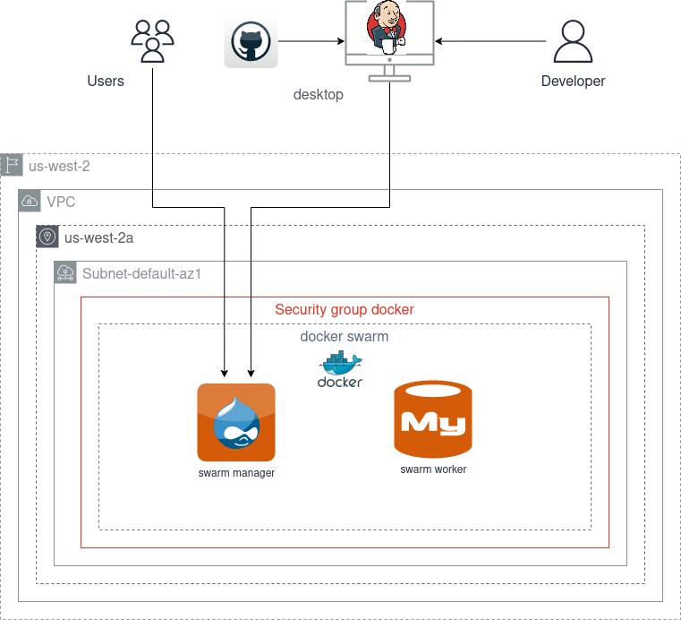

# Docker swarm infrastructure in AWS

## Infrastructure

Drupal+nginx application deployed to docker swarm.
Infrastructure as code developed by Terraform.

Infrastructure scheme:

## Referenses

[Administer and maintain a swarm of Docker Engines](https://docs.docker.com/engine/swarm/admin_guide/)

[Manage nodes in a swarm](https://docs.docker.com/engine/swarm/manage-nodes/)

[My way of recovering from a #Docker #Swarm meltdown effectively](https://xxradar.medium.com/my-way-of-recovering-from-a-docker-swarm-meltdown-effectively-ab90884203f9)

[Swarm mode overview](https://docs.docker.com/engine/swarm/)

[docker swarm init](https://docs.docker.com/engine/reference/commandline/swarm_init/)

[docker swarm join](https://docs.docker.com/engine/reference/commandline/swarm_join/)

[docker stack](https://docs.docker.com/engine/reference/commandline/stack/)

